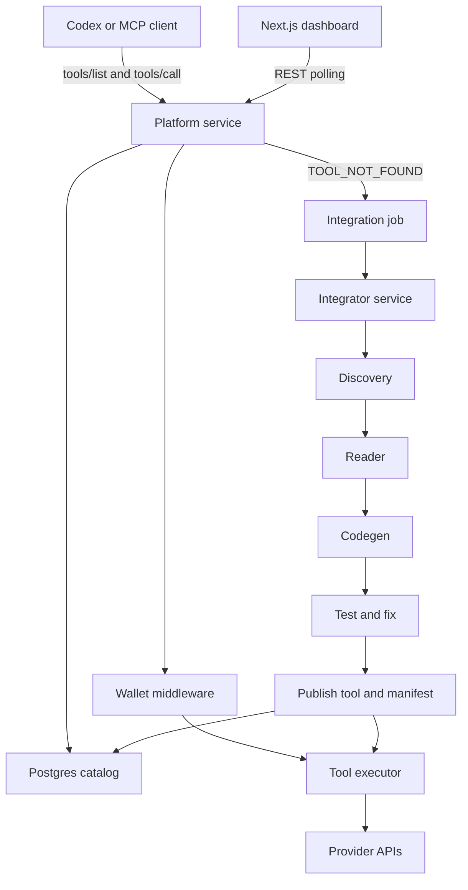

# FuseKit

> Agentic API marketplace for Codex: one MCP URL for discovering, calling, billing, and growing tools.

[](https://openai.com)
[](https://nextjs.org)
[](https://fastapi.tiangolo.com)
[](https://modelcontextprotocol.io)
[](https://turbo.build)

## Why It Exists

Codex can plan and build software quickly, but real apps still slow down when they need external APIs. Developers have to find docs, write wrappers, handle credentials, track usage, and make the result reusable.

FuseKit turns those APIs into reusable platform capabilities. Codex talks to FuseKit over MCP at build time, while deployed apps can call the same capabilities over HTTP at runtime.

## What It Does

- Exposes an MCP server with `tools/list` and `tools/call`.
- Stores tool definitions, costs, schemas, and status in Postgres.
- Checks wallet balance and deducts credits before every billable tool call.
- Executes built-in tools such as `scrape_url`, `send_email`, `send_sms`, `search_web`, and `get_producthunt`.
- Returns deterministic MCP errors, including `TOOL_NOT_FOUND` and `INSUFFICIENT_FUNDS`.
- Queues missing capabilities as integration jobs.
- Runs a bounded integration pipeline: discovery, reader, codegen, test/fix, publish.
- Publishes successful tools back into the catalog so the next Codex request can use them.
- Provides a Next.js dashboard for catalog browsing, wallet state, credentials, live feed, and manual docs URL integration.

## Demo Story

A developer asks Codex to build or run a workflow that needs scraping, email, SMS, or an API that is not available yet. Codex asks FuseKit what tools exist. If a tool is live, FuseKit checks the wallet, executes it, logs the result, and returns data to Codex.

If the tool is missing, FuseKit creates an integration job. The integrator reads the API docs, generates a Python adapter, tests and repairs it, publishes a tool definition and runtime manifest, then makes the new tool visible through `tools/list`, `/api/catalog`, and `/api/execute/{tool_name}`.

## Architecture



## Demo Critical Path

1. Codex connects to `http://localhost:8000/mcp/http`.
2. `tools/list` returns live catalog tools.
3. Codex executes `scrape_url`, `send_email`, and `send_sms`.
4. Wallet checks run before every `tools/call`.
5. A missing tool returns `TOOL_NOT_FOUND` and queues an integration job.
6. The integrator moves through discovery, reader, codegen, test/fix, and publish.
7. The new tool appears in the catalog and becomes callable.
8. Final output is delivered as email, SMS, or fetched data.

## Why This Fits Codex

FuseKit uses Codex where it is strongest: reading unfamiliar technical docs, writing integration code, fixing errors, and turning a one-off request into reusable infrastructure. The result is not another planner. It is a tool platform that gives Codex a stable MCP surface, a wallet-aware execution layer, and a path for handling capability gaps without leaving the workflow.

## Monorepo Layout

```text
.
|-- apps/web                 # Next.js marketplace UI
|-- services/platform        # FastAPI MCP server, REST APIs, wallet, execution
|-- services/integrator      # Python integration pipeline
|-- packages/contracts       # Shared JSON contracts
|-- infra                    # Docker, Alembic, service images
|-- scripts                  # Smoke tests, seed helpers, contract checks
`-- docs                     # Architecture notes and demo flow
```

## Key Services

| Area | Location | Responsibility |
| --- | --- | --- |
| Frontend | `apps/web` | Catalog, wallet, credentials, live feed, integration form |
| Platform | `services/platform` | MCP transports, REST APIs, tool registry, wallet, execution logs |
| Integrator | `services/integrator` | Docs discovery, spec reading, codegen, test/fix, publish |
| Contracts | `packages/contracts` | JSON schemas shared by TypeScript and Python |
| Infra | `infra` | Postgres, MinIO, Docker images, Alembic migrations |

## Important Endpoints

| Endpoint | Purpose |
| --- | --- |
| `GET /health` | Platform health check |
| `GET /mcp/sse` | Legacy MCP SSE transport |
| `ANY /mcp/http` | MCP Streamable HTTP transport |
| `GET /api/catalog` | List catalog tools |
| `GET /api/catalog/recent` | Recently published tools |
| `GET /api/wallet/balance` | Current wallet balance |
| `POST /api/wallet/topup` | Add demo credits |
| `POST /api/integrate` | Queue an integration from docs |
| `GET /api/integrate/{job_id}` | Poll integration status |
| `POST /api/execute/{tool_name}` | Runtime execution endpoint for deployed apps |
| `GET /api/capabilities/{tool_name}/manifest` | Machine-readable runtime contract |

## Local Setup

### Prerequisites

- Python 3.11+
- Node.js 20+
- pnpm
- Docker and Docker Compose

### Install

```bash
pnpm setup
```

### Environment

Create a root `.env` file with the keys needed for the demo path you want to run.

```bash
OPENAI_API_KEY=
RESEND_API_KEY=
RESEND_FROM_EMAIL=
TWILIO_ACCOUNT_SID=
TWILIO_AUTH_TOKEN=
TWILIO_FROM_NUMBER=
SERPER_API_KEY=
PRODUCTHUNT_API_TOKEN=
```

FuseKit does not auto-acquire third-party credentials. Provider keys are loaded by the platform, not by Codex.

### Run

```bash
pnpm dev
```

This starts:

- Postgres on `localhost:5432`
- Platform API and MCP server on `localhost:8000`
- Integrator service on `localhost:8001`
- Web dashboard on `localhost:3000`

Seed demo data if needed:

```bash
pnpm db:seed
```

The demo MCP token is:

```text
demo-token-fusekit-2026
```

## Connect Codex

Use the Streamable HTTP MCP endpoint:

```text
http://localhost:8000/mcp/http
```

For CLI setup:

```bash
export FUSEKIT_MCP_TOKEN="demo-token-fusekit-2026"

codex mcp add fusekit \
  --url "http://localhost:8000/mcp/http" \
  --bearer-token-env-var FUSEKIT_MCP_TOKEN

codex mcp list
```

The web app also includes a Connect page with setup snippets for VS Code, the Codex app, and CLI.

## Verification

Run these after the stack is up:

```bash
curl http://localhost:8000/health
curl http://localhost:8000/api/catalog
python scripts/validate_contracts.py
python scripts/smoke_demo.py
pnpm build
```

`scripts/smoke_demo.py` checks the core demo flow: MCP discovery, tool execution, wallet deduction, missing-tool integration, catalog growth, and execution of the newly published tool.

## Design Principles

- Keep Codex as the planner; FuseKit is the tool platform.
- Keep business logic out of the frontend.
- Keep MCP error responses deterministic.
- Use simple polling for the demo surface.
- Use bounded retries for generated integrations.
- Require explicit provider credentials before live third-party execution.

## Built For The OpenAI Codex Hackathon

FuseKit demonstrates Codex as an engineering collaborator inside a real platform loop. It does not only generate code once. It helps discover an API, produce an adapter, test it, publish it, and make it immediately reusable through MCP and HTTP contracts.

## License

MIT
