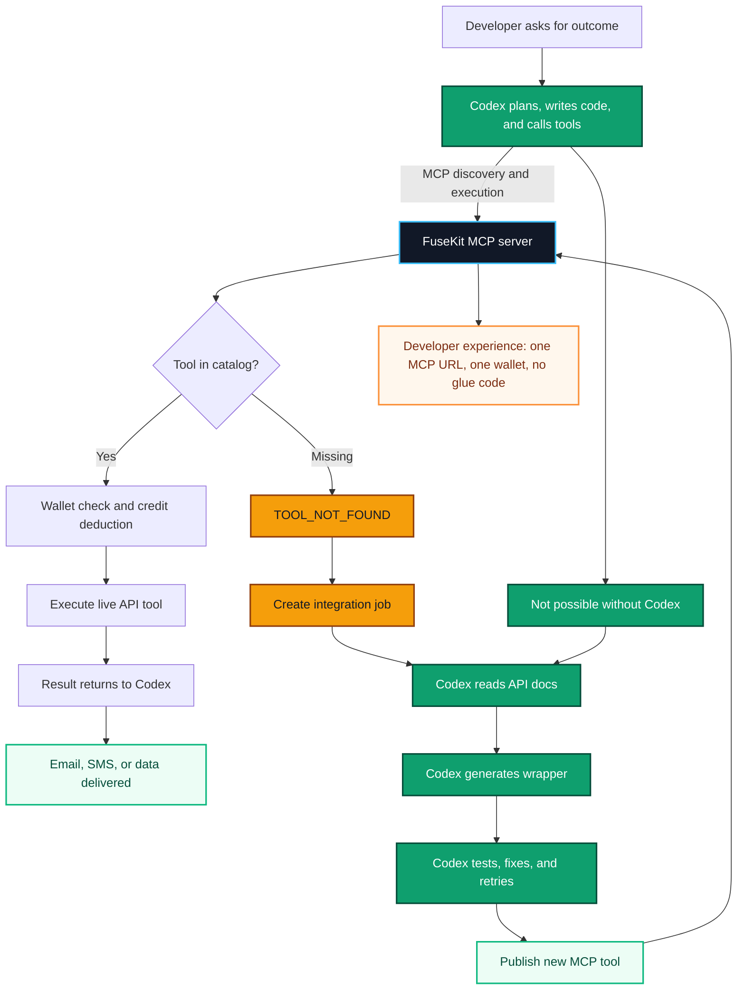

# Hackathon Video Flow

Use this diagram for the 20-30 second architecture moment in the submission
video. It compresses `docs/flow.md` into the critical story: Codex discovers
capabilities through MCP, FuseKit executes and bills live tools, and missing
APIs become new tools through a Codex-powered integration loop.

## 25-Second Voiceover

"A developer asks for an outcome. Codex plans it, then asks FuseKit over MCP
what tools exist. If a tool is live, FuseKit checks the wallet and executes it.
If it is missing, the gap becomes an integration job. This is the Codex-only
part: it reads docs, writes code, tests, fixes errors, and publishes a new MCP
tool. Next time, that API is instant: no keys, no glue code, no context switch."

## Screen Emphasis

- Open on `Developer prompt -> Codex -> MCP server`.
- Pause on `Tool in catalog?` to show the product insight: capability gaps are
  handled inside the agent workflow.
- Zoom into `Codex integration loop` and say "this is not a script; Codex is
  doing real engineering work."
- End on `Living catalog grows` and `Developer experience`: every successful
  integration becomes reusable infrastructure.
