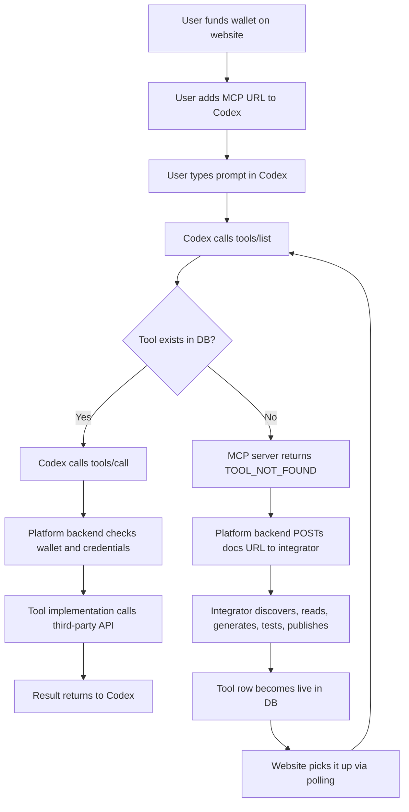

# FuseKit Phase 2 Tech Architecture and Repo Changes

## Why This Doc Exists

The updated plan and the split-build board change FuseKit in an important way:

- Codex is not the planner you build yourself anymore.
- Codex runs in OpenAI Cloud and talks to your MCP URL.
- Your product is now the platform behind that MCP URL.
- The demo is won or lost by how cleanly the backend, integration pipeline, website, and credentials story fit together.

This document turns that into a concrete tech shape and a repo structure the team can split on immediately.

## The Recommended Tech Shape

### 1. Frontend: marketplace and demo surface

Use the existing Next.js app for the website layer only.

- Framework: Next.js 16 + React 19 + TypeScript
- Styling: Tailwind 4
- Data updates: polling every 5 seconds for v1
- Goal: keep the frontend simple and visual, not responsible for orchestration

The website should own:

- catalog browser
- live integration feed
- wallet balance and wallet top-up UI
- demo request form for a docs URL
- status badges for `live`, `pending_credentials`, `integrating`, `failed`

For the hackathon version, polling is better than SSE or WebSockets because it is easier to wire fast and matches the phase board.

### 2. Platform backend: one Python service for MCP + REST API

This should be a Python service, not a Next.js API route layer.

- Runtime: Python 3.11+
- Web framework: FastAPI
- MCP: official Python `mcp` library
- HTTP client: `httpx`
- Validation: `pydantic`
- Database layer: `sqlalchemy` or `sqlmodel`
- Migrations: `alembic`
- Encryption: `cryptography`
- Payments: `stripe`

This backend should own:

- `tools/list`
- `tools/call`
- wallet middleware
- tool lookup from DB
- execution logging
- website-facing REST endpoints like `/api/catalog` and `/api/wallet`
- secure provider credential loading

Why this is the right split:

- the phase board already assumes Python for MCP
- the integration pipeline also wants Python codegen
- one Python backend keeps the MCP contracts and runtime logic close together
- the frontend stays clean and independent

### 3. Integration pipeline: separate Python service

Keep the integration pipeline as its own service so Person 2 can build in parallel and Person 1 only needs a clean trigger.

- Runtime: Python 3.11+
- Interface: `POST /integrate`
- OpenAI usage: structured reasoning calls for discovery, parsing, code generation, and fix attempts
- Execution model: synchronous job for v1, queue-backed later

Pipeline stages:

1. Discovery: given a docs URL, identify provider, auth style, base URL, and key endpoints.
2. Reader: convert docs into structured JSON.
3. Codegen: generate a Python wrapper matching your tool definition format.
4. Test and fix: run against a sandbox or safe live endpoint, retry up to 3 times.
5. Publish: write validated tool row to DB with status `live`.

This service should never acquire credentials automatically. It can only mark a tool `pending_credentials` or `live` depending on whether platform credentials already exist.

### 4. Database: demo-first now, production-ready later

Use a relational DB from the start because the board assumes tool definitions, wallet state, and logs all live there.

Recommended:

- v1 demo: SQLite if speed matters most
- post-demo: Postgres

Core tables:

- `users`
- `wallets`
- `wallet_transactions`
- `tools`
- `tool_versions`
- `tool_credentials`
- `tool_execution_logs`
- `integration_jobs`
- `integration_events`
- `crawler_findings`

Important v1 simplification:

- use platform-managed credentials, not per-user OAuth
- keep one shared encrypted credential record per provider
- let users fund calls, not connect third-party accounts

### 5. Background discovery: crawler

The crawler is useful, but it should stay very lightweight in the demo.

- Runtime: Python module or cron-like process
- Sources: Product Hunt, GitHub Trending, APIs.guru, RapidAPI marketplace
- Output: candidate API rows in `crawler_findings`
- Trigger: optional auto-create `integration_jobs` for high-confidence candidates

This should be a background bonus, not a core dependency of the live demo.

### 6. Testing and demo reliability

Use separate testing layers for each track.

- Backend tests: `pytest`
- Frontend tests: Playwright or a minimal smoke check
- Demo smoke test: one script that runs the exact end-to-end scenario and prints pass/fail per step

For the demo, the highest-value test is not unit coverage. It is a deterministic smoke run for:

- `tools/list`
- `tools/call`
- missing tool triggers `/integrate`
- tool becomes visible in catalog
- Codex retry succeeds
- final email lands in inbox

## End-to-End Tech Flow



## Repo Shape To Support Parallel Work

The current repo is a single Next.js app. That is too small and too JS-centric for the architecture shown in the board.

The cleanest next shape is a polyglot monorepo:

```text
fusekit/
├── apps/
│   └── web/                      # Next.js frontend
├── services/
│   ├── platform/                # FastAPI + MCP server + REST API
│   └── integrator/              # Integration pipeline service
├── packages/
│   └── contracts/               # Shared JSON schemas and contract examples
├── scripts/
│   ├── seed_demo_tools.py
│   ├── smoke_demo.sh
│   └── run_demo_check.py
├── infra/
│   ├── alembic/
│   └── docker-compose.yml
├── docs/
│   └── phase-2-tech-architecture.md
├── README.md
├── plan.md
├── turbo.json
├── pnpm-workspace.yaml
├── package.json
└── .env.example
```

## Recommended Directory Details

### `apps/web`

Move the current Next app here.

Recommended structure:

```text
apps/web/
├── app/
│   ├── page.tsx
│   ├── catalog/page.tsx
│   ├── demo/page.tsx
│   └── wallet/page.tsx
├── components/
│   ├── CatalogTable.tsx
│   ├── LiveFeed.tsx
│   ├── WalletCard.tsx
│   └── DocsUrlForm.tsx
├── lib/
│   └── api.ts
├── package.json
└── next.config.ts
```

### `services/platform`

This service should own both MCP and website-facing REST APIs.

```text
services/platform/
├── app/
│   ├── main.py
│   ├── mcp_server.py
│   ├── api/
│   │   ├── catalog.py
│   │   ├── wallet.py
│   │   └── integrations.py
│   ├── tools/
│   │   ├── scrape_url.py
│   │   ├── send_email.py
│   │   ├── send_sms.py
│   │   ├── search_web.py
│   │   └── get_producthunt.py
│   ├── db/
│   │   ├── models.py
│   │   ├── session.py
│   │   └── seed.py
│   ├── services/
│   │   ├── wallet_service.py
│   │   ├── catalog_service.py
│   │   └── tool_router.py
│   └── security/
│       ├── credentials.py
│       └── encryption.py
├── tests/
├── pyproject.toml
└── alembic.ini
```

### `services/integrator`

This service can be built and tested independently.

```text
services/integrator/
├── app/
│   ├── main.py
│   ├── api.py
│   ├── agents/
│   │   ├── discovery.py
│   │   ├── reader.py
│   │   ├── codegen.py
│   │   └── test_fix.py
│   ├── generators/
│   │   └── python_tool_template.py
│   ├── publishers/
│   │   └── db_writer.py
│   └── schemas/
│       ├── integrate_request.py
│       └── tool_definition.py
├── tests/
└── pyproject.toml
```

### `packages/contracts`

This package matters because the repo is polyglot. TypeScript and Python both need the same contracts.

Put source-of-truth schemas here:

- `tool-definition.schema.json`
- `integrate-request.schema.json`
- `catalog-item.schema.json`
- `wallet-response.schema.json`
- `tool-call-error.schema.json`

This avoids the frontend, MCP server, and integrator drifting apart.

## Repo Changes From The Current Codebase

These are the concrete changes I would make to this repo next:

1. Move the current Next.js app from the root into `apps/web`.
2. Turn the root `package.json` into a workspace root package instead of the app package.
3. Add `turbo.json` so frontend tasks can stay clean as the repo grows.
4. Expand `pnpm-workspace.yaml` to include `apps/*` and `packages/*`.
5. Add `services/platform` as the Python MCP + REST backend.
6. Add `services/integrator` as the standalone integration pipeline.
7. Add `packages/contracts` for JSON schemas shared across TS and Python.
8. Add `scripts/seed_demo_tools.py` to seed the first 5 tools.
9. Add `scripts/run_demo_check.py` or `smoke_demo.sh` for the stage-safe E2E run.
10. Add `.env.example` with every provider key and internal URL documented.

## Team Split Mapped To The Repo

This layout matches the 4-person track split very cleanly.

### Person 1: MCP server + catalog

Own:

- `services/platform/app/mcp_server.py`
- `services/platform/app/tools/*`
- `services/platform/app/services/wallet_service.py`
- `services/platform/app/api/catalog.py`
- `services/platform/app/api/wallet.py`
- `packages/contracts/tool-definition.schema.json`

### Person 2: integration pipeline

Own:

- `services/integrator/app/agents/*`
- `services/integrator/app/generators/*`
- `services/integrator/app/publishers/db_writer.py`
- `packages/contracts/integrate-request.schema.json`

### Person 3: marketplace website

Own:

- `apps/web/app/*`
- `apps/web/components/*`
- `apps/web/lib/api.ts`

### Person 4: credentials + E2E

Own:

- `.env.example`
- `scripts/seed_demo_tools.py`
- `scripts/run_demo_check.py`
- backend integration fixtures
- final demo scenario verification

## Contracts To Lock Before Anyone Splits Off

### Contract 1: tool definition row

This should be the DB row shape, MCP-visible shape, and integrator publish shape.

```json
{
  "name": "send_email",
  "description": "Send an email. Use when task requires email delivery.",
  "provider": "nylas",
  "schema": {
    "to": "str",
    "subject": "str",
    "body": "str"
  },
  "cost": 0.002,
  "status": "live",
  "implementation_key": "send_email",
  "added_at": "2026-04-16T09:00:00Z"
}
```

### Contract 2: integration trigger

The MCP server should not know how integration works internally. It should only call a stable endpoint.

```http
POST /integrate
Content-Type: application/json
```

```json
{
  "docs_url": "https://resend.com/docs/api-reference",
  "requested_by": "mcp_tool_miss",
  "requested_tool_name": "send_email"
}
```

Expected response:

```json
{
  "job_id": "int_123",
  "status": "queued"
}
```

### Contract 3: website API

The website only needs a small surface for the demo.

- `GET /api/catalog`
- `GET /api/catalog/recent`
- `GET /api/wallet/balance`
- `POST /api/wallet/topup`
- `POST /api/integrate`

### Contract 4: MCP error shapes

Two error codes matter for the demo:

- `TOOL_NOT_FOUND`
- `INSUFFICIENT_FUNDS`

If these are inconsistent, Codex behavior and the live demo will be harder to reason about.

## Demo-First Technology Decisions

These are the decisions I would intentionally keep simple:

- polling instead of WebSockets
- SQLite instead of Postgres if time is tight
- shared provider credentials instead of user OAuth
- 5 hand-written initial tools instead of a full dynamic catalog
- one integration endpoint instead of a queue platform
- one smoke-test script instead of a deep automated suite

These are the right shortcuts because they reduce risk without weakening the core story.

## What Must Work vs What Can Wait

### Must work by demo time

- Codex can hit the MCP URL successfully.
- `tools/list` returns seeded tools from the DB.
- `tools/call` can execute `scrape_url`, `send_email`, and `send_sms`.
- wallet checks happen before each tool call.
- a missing tool can trigger `/integrate`.
- the integrator can publish at least one new tool successfully.
- the website can show catalog items and recent additions.
- the final email lands in a real inbox.

### Nice to have

- visible wallet deduction animation
- self-correction attempts shown in the UI
- crawler adds tools automatically
- multiple successful live integrations in one run
- real-time push updates instead of polling

## Final Recommendation

Do not stretch the current root-level Next.js app into the whole platform.

The cleanest build from this board is:

- Next.js frontend in `apps/web`
- Python platform service in `services/platform`
- Python integrator in `services/integrator`
- shared JSON contracts in `packages/contracts`

That structure matches the team split, matches the tech choices in the board, and gives you the best chance of shipping a real demo without the repo fighting you.
