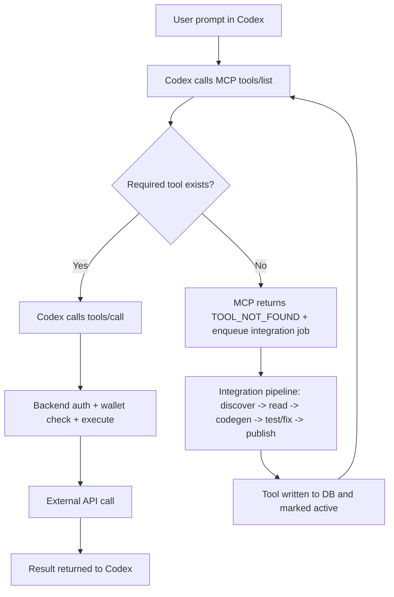
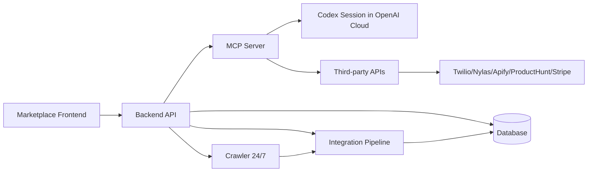

## `plan.md` — FuseKit Cloud-MCP Architecture Plan (Updated)

### Summary
FuseKit will be built as a **platform behind one MCP server URL** that users add to Codex once.  
After that, Codex (running in OpenAI Cloud) is the planner/orchestrator, and your backend handles `tools/list`, `tools/call`, wallet enforcement, dynamic integration, and catalog growth.

### Implementation Changes

1. System boundary and ownership
- Codex session (OpenAI Cloud): receives user prompt, reads `tools/list`, decides call order, retries when missing tool becomes live.
- Your frontend (marketplace website): catalog browser, live integration feed, wallet top-up, account management.
- Your backend (your servers): MCP server, platform API, integration pipeline, crawler, database, billing logic, provider credential vault.

2. MCP server as single gateway
- Implement MCP endpoints:
  - `tools/list`: return all active tools from DB with metadata (`name`, `description`, `costPerCall`, `status`, `schema`).
  - `tools/call`: auth user, wallet check, route tool execution, log usage, deduct balance.
- Missing-tool behavior:
  - return structured `TOOL_NOT_FOUND` response that also enqueues integration job.
  - once integrated and validated, tool is added to DB and appears in next `tools/list` response.

3. Data model and platform API
- Core tables:
  - `users`, `wallets`, `wallet_transactions`
  - `tools`, `tool_versions`, `tool_credentials`, `tool_execution_logs`
  - `integration_jobs`, `integration_events`, `crawler_findings`
- Backend API for frontend:
  - `GET /catalog`, `GET /catalog/live-feed`
  - `POST /wallet/topup`, `GET /wallet/balance`, `GET /wallet/transactions`
  - `GET /integrations/jobs/:id`, `GET /runs/:id/logs`
- Credentials model:
  - platform-level provider credentials stored encrypted per provider (Twilio, Nylas, Apify, Product Hunt, Stripe).
  - users do not bring provider keys in v1.

4. Integration pipeline (runs on your backend)
- Trigger conditions:
  - Codex requested missing tool.
  - crawler found high-value API candidate.
- Pipeline stages:
  1. Discovery (`api docs/source selection`)
  2. Reader (`parse docs to structured capability spec`)
  3. Codegen (`generate integration wrapper/template`)
  4. Test+fix (`sandbox/live test with retry and self-correction loop`)
  5. Publish (`write tool definition + schema + implementation ref to DB`)
- Publish rule: only mark tool `active` when schema + auth + smoke test all pass.
- On publish, emit event to live feed and expose tool via `tools/list`.

5. Crawler subsystem (24/7)
- Sources: Product Hunt, GitHub Trending, APIs.guru, RapidAPI marketplace.
- Output: ranked candidates with reason codes (`demand`, `fit`, `feasibility`, `credential availability`).
- Auto-trigger integration job for high-confidence candidates; never auto-acquire credentials.

6. Billing and wallet enforcement
- Prepaid wallet model: each MCP `tools/call` deducts defined `costPerCall`.
- Enforce balance check before execution; return `INSUFFICIENT_FUNDS` error when needed.
- Record every deduction/refund in immutable transaction ledger.
- Stripe used for wallet top-ups and webhook-confirmed settlement.

### Mermaid Diagrams

### Test Plan

1. MCP protocol and runtime
- `tools/list` returns only active tools with valid schemas.
- `tools/call` enforces auth and wallet deduction atomically.
- missing tool returns `TOOL_NOT_FOUND` and creates integration job.

2. Integration lifecycle
- end-to-end missing-tool request results in published tool visible in `tools/list`.
- failed test stage keeps tool in `inactive` state.
- Codex retry succeeds after publish.

3. Wallet and billing
- insufficient funds blocks execution with clear error.
- successful Stripe top-up updates wallet and unlocks calls.
- transaction ledger reconciles with execution logs.

4. Crawler and feed
- crawler finding creates queued integration job.
- live integration feed reflects job progress and publish events in near real time.

5. Security
- credentials encrypted at rest and never returned to client/Codex.
- audit logs capture who called what and cost charged.

### Assumptions and Defaults
- Codex is treated as external orchestrator; platform does not implement its own planner in v1.
- Dynamic integrations are DB-registered wrappers first; full autonomous arbitrary code execution is out of v1 scope.
- Credential acquisition remains manual/platform-managed; only code integration is autonomous.
- v1 targets demo reliability with Twilio, Nylas, Apify, Product Hunt, Stripe as initial provider set.
